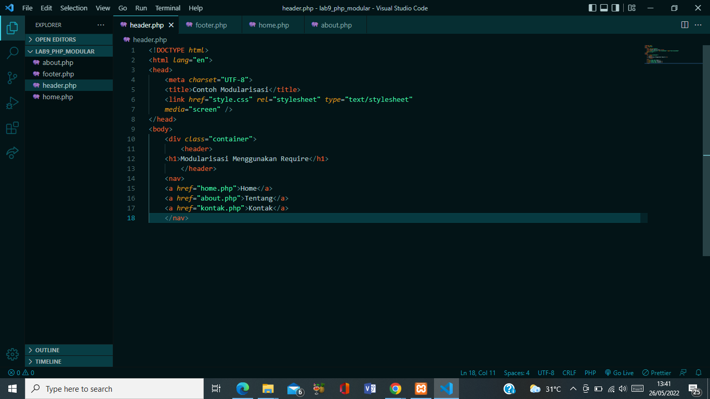
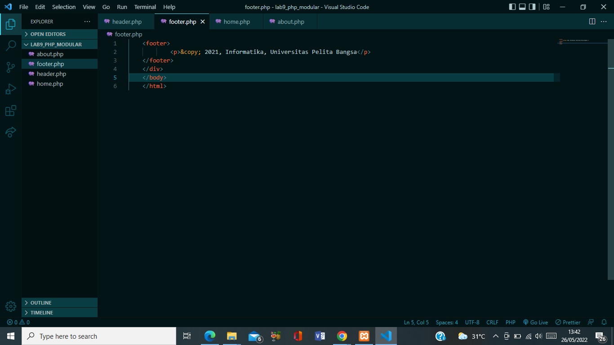
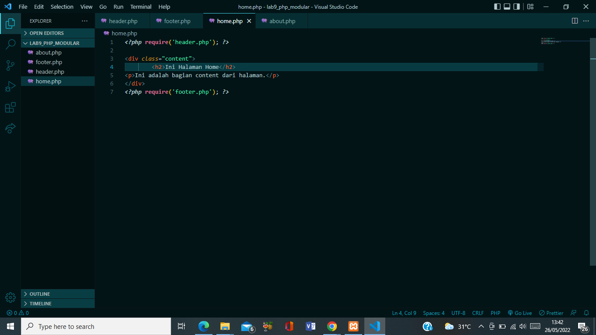
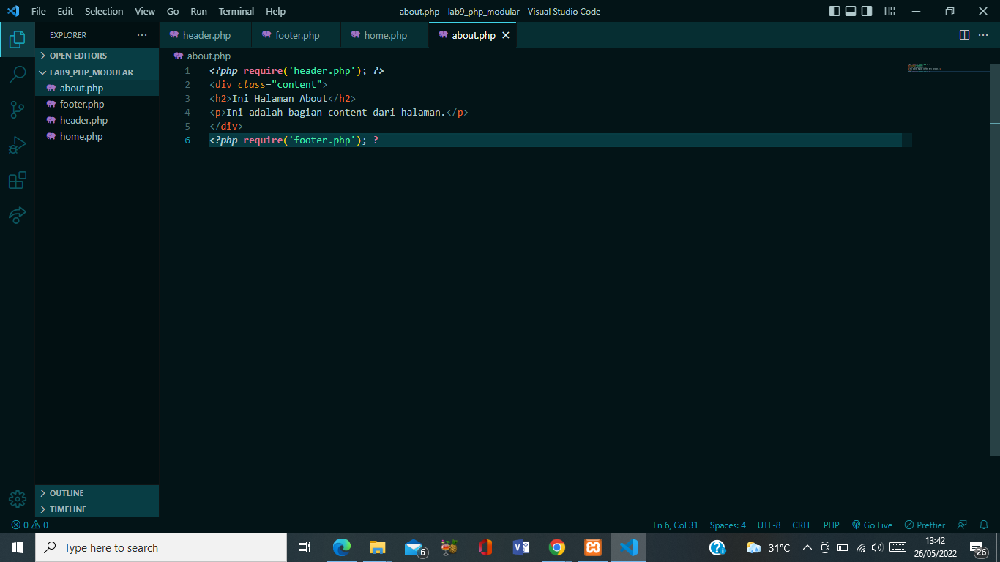
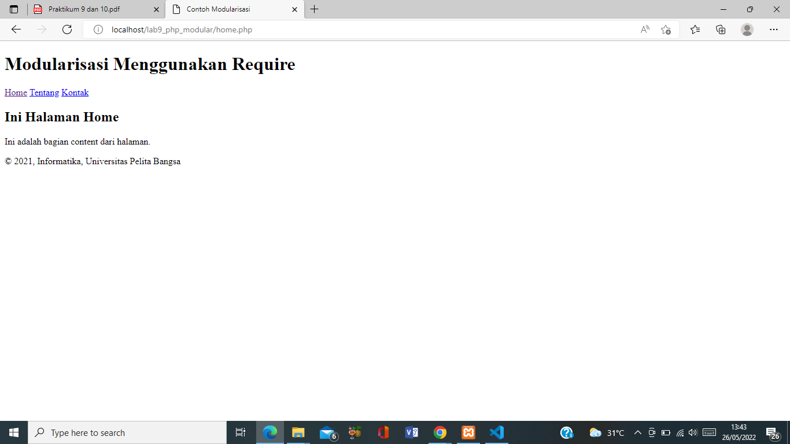
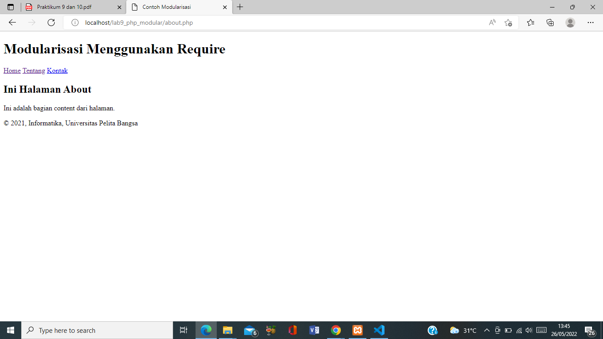

| Nama | Nova Tegar Adiyansyah |
| --------| ---------------| 
| Nim | 312010145 |
| Kelas | TI.20.A1 |

## Langkah langkah Praktikum 9

## 1. Buat file baru dengan nama header.php

## 2. Buat file baru dengan nama footer.php

## 3. Buat file baru dengan nama home.php

## 4.  Buat file baru dengan nama about.php

## 5. Output

 

## Pertanyaan dan Tugas
Implementasikan konsep modularisasi pada kode program praktikum 8 tentang
database, sehingga setiap halamannya memiliki template tampilan yang sama.

+-- config 
            koneksi.php
            tambah.php
+-- layouts
    +-- footer.html
    +-- header.html
+-- static
        +-- default.html
        +-- post.html
    +-- index.html